Programas de ordenador
======================
Todos los programas de ordenador tales como las macros Python o JavaScript
se distribuyen bajo licencia MIT.

Texto de los cuestionarios
==========================
Autores de los cuestionarios:
 - Tucho Méndez
 - Carlos Pardo

El texto de los cuestionarios (preguntas y opciones de respuesta) 
se distribuyen bajo licencia Creative Commons CC0 1.0 Universal 
(bajo dominio público)
Se puede leer el texto de la licencia en el enlace: https://creativecommons.org/publicdomain/zero/1.0/deed.es_ES

Imágenes de los cuestionarios
=============================
Las imágenes de los cuestionarios se distribuyen bajo diferentes 
licencias.

Las siguientes imágenes creadas por Tucho y que se pueden encontrar 
en el repositorio https://github.com/procastino/bancosTecno
se distribuyen bajo **licencia Creative Commons CC0 1.0 Universal** 
(bajo Dominio Público).
Se puede leer el texto de la licencia en el enlace: https://creativecommons.org/publicdomain/zero/1.0/deed.es_ES

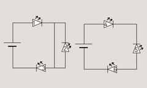
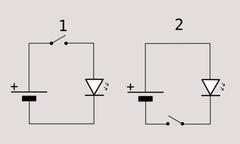
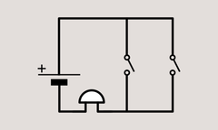
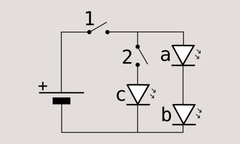
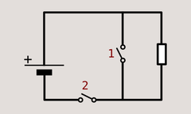
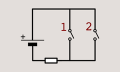
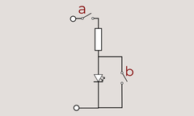
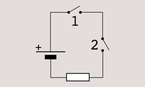
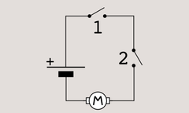
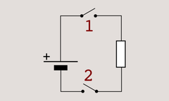
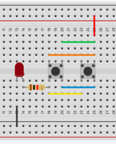
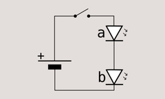
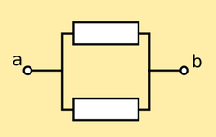
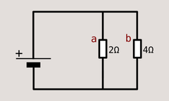
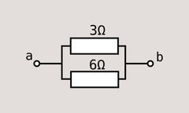
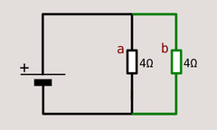

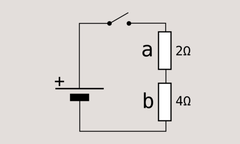
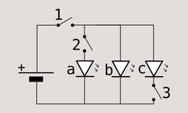
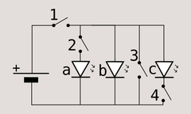
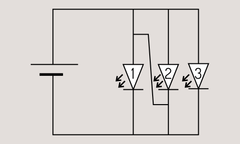
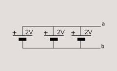
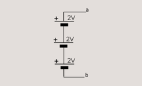
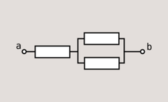
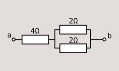
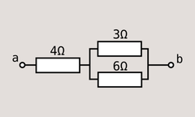
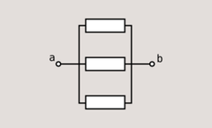
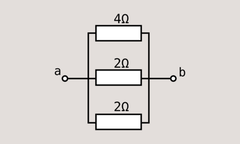
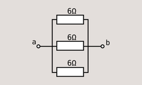
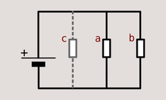

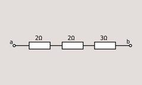
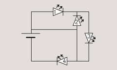
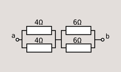
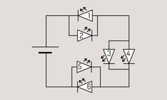
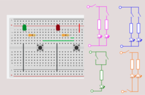
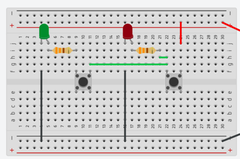
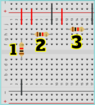
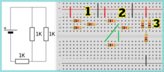
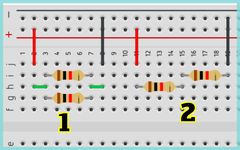
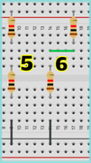
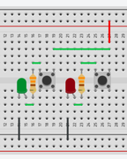
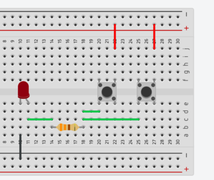
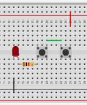
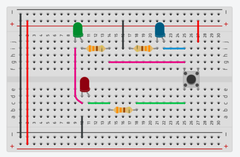
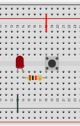

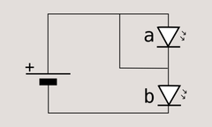
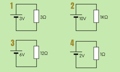
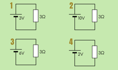
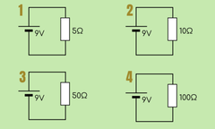
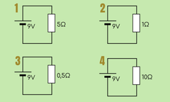
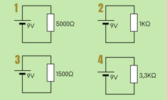

Las siguientes imágenes creadas por Carlos Pardo y que se pueden encontrar 
en el repositorio  https://github.com/picuino/tecno-recursos
se distribuyen bajo **licencia Creative Commons BY-SA 4.0.**
Se puede leer el texto de la licencia en el enlace: https://creativecommons.org/licenses/by-sa/4.0/deed.es

  Source: https://github.com/picuino/tecno-recursos
  Autor: Carlos Pardo
  Licencia_tipo: Creative Commons BY-SA 4.0
  Licencia_link: https://creativecommons.org/licenses/by-sa/4.0/deed.es
